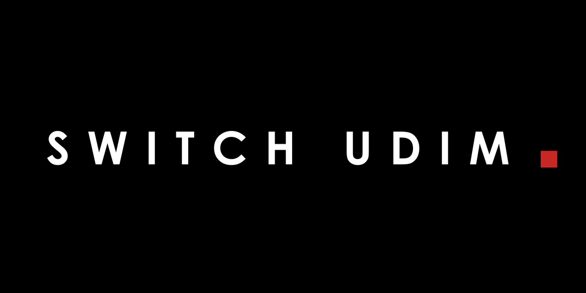

# Switch UDIM

Blender addon for quickly switching Image Texture nodes between **Single Image** and **UDIM Tiles** modes.

*Документация на русском: [README.ru.md](README.ru.md)*

## Installation

### Blender 4.2+ (Extension)

1. Download `switch_udim_extension.zip` from the [latest release](https://github.com/abyrvalg379/Switch_UDIM/releases/latest)
2. Blender → **Edit** → **Preferences** → **Get Extensions** → **⚙** → **Install from Disk...**
3. Select `switch_udim_extension.zip`

### Blender 3.0–4.1 (Legacy Add-on)

1. Download `switch_udim_legacy.zip` from the [latest release](https://github.com/abyrvalg379/Switch_UDIM/releases/latest)
2. Blender → **Edit** → **Preferences** → **Add-ons** → **Install...**
3. Select `switch_udim_legacy.zip`
4. Enable the addon with the checkbox

### From Repository

Copy the `switch_udim` folder to:
- **Windows:** `%APPDATA%\Blender Foundation\Blender\<version>\scripts\addons\`
- **macOS:** `~/Library/Application Support/Blender/<version>/scripts/addons/`
- **Linux:** `~/.config/blender/<version>/scripts/addons/`

## Usage

Open **Shader Editor** → press **N** → **UDIM** tab.

| Button | Action |
|--------|--------|
| **Single → UDIM** | Switch selected Image Texture nodes (or all, if nothing is selected) from Single Image to UDIM Tiles |
| **UDIM → Single** | Switch selected Image Texture nodes (or all) from UDIM Tiles to Single Image |
| **UDIM Stats** | Statistics: texture count, tile count, disk size, missing files |
| **Reload Changed** | Reload only the textures whose files changed on disk (UDIM checked per tile); a disk snapshot survives Blender restarts, so edits made outside Blender are caught |

### Auto Connect

Scans a folder (or images already loaded in the .blend) and wires PBR maps into the **Principled BSDF** by asset naming.

- **Connect from Folder** — pick a folder with textures
- **Connect Blend Images** — use images already loaded into the .blend
- **Overwrite links** — reconnect sockets that are already linked
- **Copy Image Settings** — copy colorspace / interpolation / extension / projection from the active image node to the selected ones

Naming convention: `Asset_Role.ext`, UDIM: `Asset_Role.1001.ext` (2+ tiles → UDIM Tiles automatically). The asset name must match the object, mesh or material name.

| Suffix (default) | Target |
|--------|--------|
| basecolor, albedo, diffuse, color | Base Color (sRGB) |
| ao, occlusion | Multiplied into Base Color (Non-Color) |
| emission, emissive | Emission Color (sRGB) |
| roughness | Roughness (Non-Color) |
| gloss, glossiness | Invert node → Roughness (Non-Color) |
| metallic | Metallic (Non-Color) |
| specular | Specular IOR Level (Non-Color) |
| transmission | Transmission Weight (Non-Color) |
| opacity, alpha | Alpha (Non-Color) |
| normal | Normal Map node (Non-Color); DX normal maps are skipped with a report |
| bump | Bump node → Normal (Non-Color) |
| displacement, height | Displacement node → Material Output (Non-Color) |
| mask, msk | Factor of the overlay Mix on Base Color (Non-Color) |

**Overlay by mask**: `<Asset>_mask.png` mixes `<Asset>_basecolor.png` with `<Asset>_basecolor_2.png` (Mix Color, MULTIPLY-style chain) and feeds Base Color. No `basecolor_2` file? The mix gets a white constant — paint the overlay color by hand. No `basecolor` file? The mask can't be applied and is reported.

Suffix keywords are editable in **Edit → Preferences → Add-ons → Switch UDIM**. Colorspace is resolved the Node Wrangler way (`is_data`) and works on both standard and ACES OCIO configs.

**Production naming** is recognized too: `asset.role_qualifier.1001.ext` (e.g. `mi24.basecolor_acescg.1001.exr`). The role token is matched anywhere in the name, generic qualifiers (`raw`, `acescg`, ...) are dropped. Named masks (`mi24.mask_dirt01_raw.1001.exr` — camo sets carry a dozen of them) are loaded as labeled UDIM texture nodes left unlinked for manual lookdev wiring. EXR color maps keep the colorspace the OCIO file rule gave them — linear stays linear.

## Screenshots

<!-- TODO: add panel screenshots -->

## Requirements

- Blender 3.0+

## License

GNU General Public License v3.0 — see [LICENSE](LICENSE)

## Author

**Maksim Kovalev**

---

## 🔗 Related Tools

| Tool | Description |
|------|-------------|
| [STUKACH](https://github.com/abyrvalg379/STUKACH) | Pipeline asset validator for Blender |
| [LAMPOCHKA](https://github.com/abyrvalg379/LAMPOCHKA) | Scene light manager |
| [FLOMASTER](https://github.com/abyrvalg379/FLOMASTER) | OCIO launcher for DCC apps |
| [FILTER](https://github.com/abyrvalg379/FILTER) | Toggle visibility/selection by type, name, collection + bulk modifier management (apply, remove, diff) |
| [KARUSELKA](https://github.com/abyrvalg379/karuselka) | Fast camera turntable rig: orbit or object spin |
